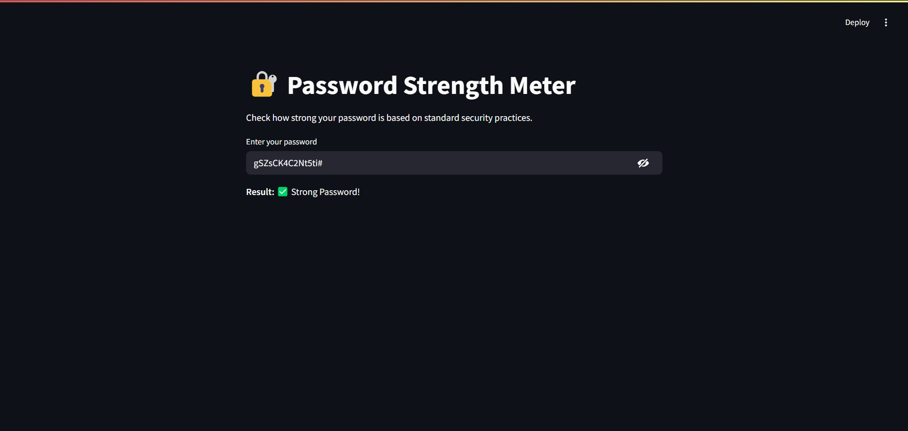

# 🔐 Project 02 - Password Strength Meter

A simple and interactive web app built using Python and Streamlit that evaluates the strength of a user's password in real-time.

---

## 🌟 Features

- Analyzes passwords based on:
  - Length
  - Uppercase & lowercase characters
  - Numeric digits
  - Special characters (!@#$%^&*)
- Real-time feedback and suggestions
- Categorizes passwords as **Weak**, **Moderate**, or **Strong**
- Clean and responsive UI

---

## 📷 Screenshot

---

## 🎯 Objective

The goal of this project is to create a tool that helps users understand how strong or weak their passwords are by checking them against basic security rules. It demonstrates the use of:

- Control flow and conditions
- Type casting and string operations
- Regular expressions (`re` module)
- Functions
